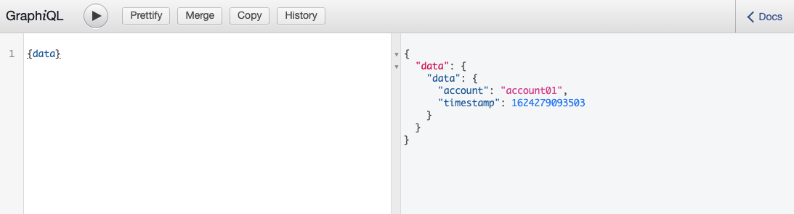
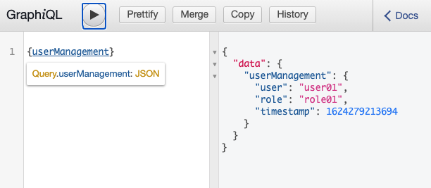

## DistributedECSTaskStack

`lib/cdk-stack` builds the Docker image locally, push the image to `ECR` and provision the AWS Fargate to run the two simple `express-graphql` on HTTP

### How to deploy the stack

1. Make sure `cdk` is installed. The command to install is `npm install -g aws-cdk@latest`
2. Runs the `cdk deploy` in the `cdk/` folder

## To test
Once the 2 Fargate tasks are created, copy the output values of each URL, and open up in a browser.

* For account management service, enter `{data}` in the query screen, you will get the response in 
* For user management service, enter `{userManagement}` in the query screen, you will get the response in 

